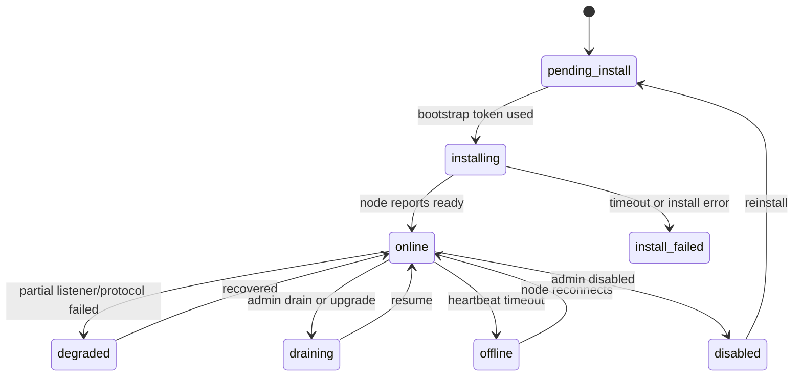

# 后台节点安装流程

本文从后台管理页面角度设计 Linux 节点的一键安装流程。目标是管理员创建节点后，后台直接给出安装命令，服务器执行后自动上线。

## 节点创建页面字段

基础字段：

| 字段 | 必填 | 说明 |
| --- | --- | --- |
| `name` | 是 | 节点名称，例如 `HK-Game-01` |
| `server_ip` | 是 | 默认入口 IP |
| `server_port` | 是 | 节点入口端口 |
| `area` | 是 | 加速地区，例如 `HK`、`JP`、`US` |
| `bandwidth_quality` | 是 | `fast`、`normal`、`slow` |
| `status` | 是 | 默认创建后为 `pending_install` |

网络能力：

| 字段 | 必填 | 说明 |
| --- | --- | --- |
| `is_support_ipv6` | 否 | 是否启用 IPv6 转发 |
| `disable_quic` | 否 | 是否禁用 QUIC 类协议 |
| `is_local_ip` | 否 | 是否本地/内网 IP |

中继：

| 字段 | 必填 | 说明 |
| --- | --- | --- |
| `relay_server_ip` | 否 | 中继服务器 IP |
| `relay_server_port` | 否 | 中继服务器端口 |

运营商入口：

| 字段 | 必填 | 说明 |
| --- | --- | --- |
| `telecom_ip` | 否 | 电信入口 IP |
| `mobile_ip` | 否 | 移动入口 IP |
| `unicom_ip` | 否 | 联通入口 IP |

业务标签：

| 字段 | 必填 | 说明 |
| --- | --- | --- |
| `tag` | 否 | `free` 免费节点、`shanghao` 上号专用节点等 |

## 后台状态机



## 安装命令生成

管理员点击“生成安装命令”：

1. 后台生成 `bootstrap_token`。
2. token 绑定 `node_id`、创建人、过期时间、一次性使用次数。
3. 后台展示命令。
4. 复制命令到 Linux 服务器执行。

命令：

```bash
curl -fsSL https://install.example.com/xaccel-node.sh | bash -s -- \
  --bootstrap-url https://api.example.com/api/node/v1/bootstrap \
  --bootstrap-token <token>
```

可选参数：

```bash
--open-firewall
--channel stable
--force
```

`--force` 只允许重装同一个 node identity，不能把 A 节点身份覆盖成 B 节点。

## Bootstrap Token 表

建议表：`node_bootstrap_tokens`

| 字段 | 说明 |
| --- | --- |
| `id` | 主键 |
| `node_id` | 节点 ID |
| `token_hash` | token 哈希，不存明文 |
| `expires_at` | 过期时间 |
| `used_at` | 使用时间 |
| `used_by_ip` | 使用来源 IP |
| `created_by` | 管理员 ID |
| `created_at` | 创建时间 |

token 明文只展示一次。

## 节点表建议字段

建议表：`accel_nodes`

```text
id
name
server_ip
server_port
relay_server_ip
relay_server_port
is_support_ipv6
bandwidth_quality
disable_quic
area
is_local_ip
telecom_ip
mobile_ip
unicom_ip
tag
status
node_secret_hash
installed_at
last_seen_at
last_report_at
kernel_version
config_revision
install_error
created_at
updated_at
```

`node_secret` 明文只在 bootstrap 响应中返回给安装器，后台存哈希或可解密密文。生产环境更推荐用 KMS 或密钥封装存储。

## 安装完成回写

节点安装器调用 bootstrap 后，后台把节点状态从 `pending_install` 改为 `installing`。

`xaccel-node` 首次启动并成功上报：

```json
{
  "node_id": 1001,
  "status": "ready",
  "kernel_version": "0.1.0",
  "config_revision": 20001,
  "listeners": [
    {"addr": "1.2.3.4:666", "transport": "quic_udp", "status": "listening"}
  ]
}
```

后台更新：

```text
status = online
installed_at = now
last_seen_at = now
kernel_version = 0.1.0
```

如果安装失败，安装器应上报：

```json
{
  "node_id": 1001,
  "status": "install_failed",
  "error_code": "PORT_IN_USE",
  "error_message": "server_port 666 is already in use"
}
```

## 后台节点详情页

建议显示：

- 节点状态：online、offline、degraded、draining、pending_install。
- 一键安装命令：未安装或重装时显示。
- 节点版本和升级按钮。
- 当前配置版本。
- 入口监听状态。
- QUIC 是否启用。
- IPv6 是否启用。
- 中继链路状态。
- 最近 15 分钟 RTT、丢包、抖动、上下行速率。
- 活跃用户、活跃设备、活跃游戏。
- 最近错误。

## 防止误装

安装器 bootstrap 时要提交本机 IP 列表。后台检查：

- `server_ip` 是否在本机 IP 列表中。
- `telecom_ip/mobile_ip/unicom_ip` 如果填写，也必须在本机 IP 列表中。
- 如果不匹配，bootstrap 可以返回 `IP_NOT_FOUND_ON_HOST`。

这样可以避免管理员把 HK 节点命令误装到 JP 服务器。

