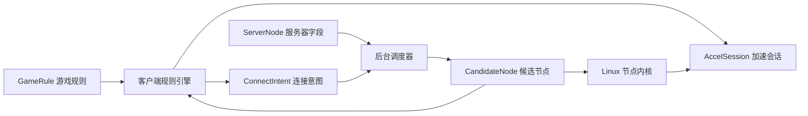

# 领域模型

本文把两个 Word 文档中的字段拆成游戏规则、服务器节点、连接会话和调度策略四个领域。这个项目不是订阅代理面板模式，而是游戏加速器模式。

## 游戏规则 GameRule

游戏规则主要给客户端使用，决定哪些进程、域名、IP、端口和协议需要进入加速通道。

| 字段 | 归属 | 说明 |
| --- | --- | --- |
| `game_id` | 后台/客户端 | 游戏唯一 ID |
| `game_name` | 后台/客户端 | 游戏名称；路由规则也保存一份用于控制台展示 |
| `platform` | 后台/客户端 | `pc`、`ios`、`android` |
| `game_type` | 后台/客户端 | `platform`、`game`、`web` |
| `game_platform` | 后台/客户端 | `steam`、`rockstar` 等 |
| `start_url` | 客户端 | 启动游戏或平台的 URL |
| `image` | 客户端 | 游戏图片 |
| `bandwidth_quality` | 调度 | 期望线路质量：`fast`、`normal`、`slow` |
| `process_rules` | 客户端 | 按进程名、签名、MD5 匹配 |
| `domain_rules` | 客户端 DNS/路由 | 域名、端口、协议、是否加速 |
| `ip_rules` | 客户端路由 | IP CIDR、端口、协议、是否加速 |
| `hosts` | 客户端 | 需要写入系统 hosts 的记录 |
| `smart_dns` | 客户端/调度 | 域名预解析和低延迟 IP 选择 |
| `clear_hosts` | 客户端 | 加速结束后是否清理 hosts |
| `cmd_exec` | 客户端 | 加速前执行命令，应做白名单和用户确认 |
| `skip_mainland_ip` | 客户端路由 | 是否跳过中国大陆 IP |
| `fake_ping_value` | 客户端显示层 | 建议只作为 UI 显示修正，不篡改系统或游戏包 |

## 服务器节点 ServerNode

服务器管理字段主要用于后台调度和 Linux 节点启动配置。

| 字段 | 归属 | 说明 |
| --- | --- | --- |
| `id` | 后台/节点 | 节点 ID |
| `server_ip` | 节点 | 默认入口 IP |
| `server_port` | 节点 | 节点监听端口 |
| `relay_server_ip` | 调度/节点 | 中继服务器 IP，可选 |
| `relay_server_port` | 调度/节点 | 中继服务器端口，可选 |
| `is_support_ipv6` | 调度/节点 | 是否支持 IPv6 转发 |
| `bandwidth_quality` | 调度 | 线路质量标签：`fast`、`normal`、`slow` |
| `disable_quic` | 调度/节点 | 是否禁用 QUIC 类协议 |
| `area` | 调度 | 节点地区，例如 `HK`、`JP`、`US` |
| `is_local_ip` | 调度 | 是否本地 IP，通常用于边缘/内网线路 |
| `telecom_ip` | 调度/节点 | 电信入口 IP |
| `mobile_ip` | 调度/节点 | 移动入口 IP |
| `unicom_ip` | 调度/节点 | 联通入口 IP |
| `tag` | 调度 | `free`、`shanghao` 等业务标签 |
| `status` | 后台/调度 | 是否启用 |

## 核心实体

### GameRule

后台下发给客户端。客户端编译规则后生成本地路由表、DNS 策略、进程匹配器和连接意图。

### NodeProfile

后台下发给 Linux 节点。包含监听 IP/端口、中继配置、IPv6、QUIC 开关、地区、运营商 IP 和节点标签。

### ConnectIntent

客户端开始加速某个游戏时向后台申请。内容包括用户、设备、游戏、区服、网络运营商、客户端公网 IP、期望质量。

### CandidateNode

后台根据 `ConnectIntent` 返回的候选节点。包含节点地址、协议能力、临时凭据、测速参数和备用节点。

### AccelSession

节点内核中的转发会话。按用户、设备、游戏、协议、源地址、目标地址、端口五元组统计连接、流量、RTT、丢包和抖动。

## 关系

