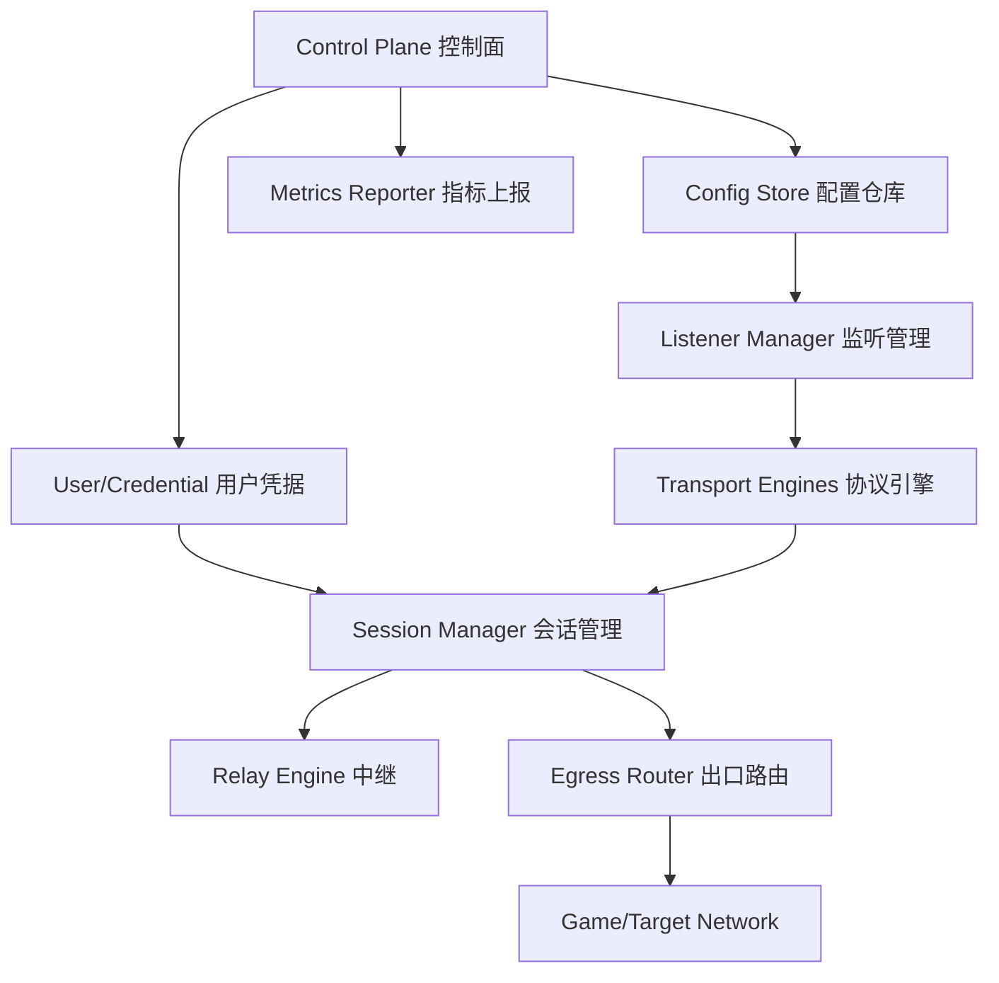

# Linux 节点内核设计

这里的“节点内核”指运行在 Linux 服务器上的自研加速节点核心，不是第一阶段就写 Linux kernel module。建议先做 userspace daemon，稳定后再引入 eBPF/XDP/tc 做性能增强。

## 目标

- 承载游戏 TCP/UDP 转发，优先优化 UDP。
- 支持直连节点和中继节点。
- 支持按地区、运营商 IP、线路质量、业务标签调度。
- 支持 QUIC 类协议开关，满足 `disable_quic` 字段。
- 支持 IPv4/IPv6 双栈能力。
- 支持热更新配置、热更新用户、不中断已有会话。
- 上报流量、在线、RTT、丢包、抖动、节点负载和协议质量。

## 非目标

- 节点不负责进程识别、hosts 写入、smart DNS 本地选择，这些属于客户端。
- 节点不执行 `cmd_exec`，避免远程命令执行风险。
- 第一阶段不强依赖内核态模块。

## 推荐进程

进程名：`xaccel-node`

目录建议：

```text
/usr/local/bin/xaccel-node
/etc/xaccel-node/config.toml
/var/lib/xaccel-node/
/var/log/xaccel-node/
/run/xaccel-node/
```

systemd：

```ini
[Unit]
Description=XAccel Linux Acceleration Node
After=network-online.target
Wants=network-online.target

[Service]
ExecStart=/usr/local/bin/xaccel-node --config /etc/xaccel-node/config.toml
Restart=always
RestartSec=3
LimitNOFILE=1048576
AmbientCapabilities=CAP_NET_BIND_SERVICE CAP_NET_ADMIN CAP_NET_RAW
NoNewPrivileges=true

[Install]
WantedBy=multi-user.target
```

`CAP_NET_ADMIN` 和 `CAP_NET_RAW` 可以按功能裁剪；如果第一阶段只监听高端口且不创建 TUN，可先不授予。

## 模块划分



### 控制面 Control Plane

职责：

- 启动时向后台注册。
- 拉取节点配置和版本号。
- 建立 WebSocket 或长轮询，接收热更新。
- 上报健康、流量和线路质量。
- 校验配置签名和过期时间。

### 配置仓库 Config Store

职责：

- 保存当前配置、上一版配置和配置版本。
- 支持原子切换。
- 配置错误时自动回滚。
- 将 `disable_quic`、`is_support_ipv6`、运营商 IP 等字段编译成运行时策略。

### 监听管理 Listener Manager

根据节点配置启动监听：

- 默认入口：`server_ip:server_port`
- 电信入口：`telecom_ip:server_port`
- 移动入口：`mobile_ip:server_port`
- 联通入口：`unicom_ip:server_port`
- IPv6 入口：当 `is_support_ipv6 = true` 时启用

Linux 实现要点：

- 使用 `SO_REUSEPORT` 提升多核 UDP/TCP 接入能力。
- 多 IP 机器需要按入口 IP 绑定 socket。
- 如果入口 IP 不在本机网卡上，不应强行启动，应上报配置错误。
- 多运营商出口可以配合 Linux policy routing。

### 协议引擎 Transport Engines

第一阶段建议重点做：

- UDP over QUIC：游戏 UDP 主通道。
- TCP over TLS/QUIC：游戏下载、登录、平台服务通道。
- Relay tunnel：节点到中继节点的二段转发。

如果 `disable_quic = true`：

- 不启动 QUIC 监听。
- 客户端候选节点中标记该节点只支持 TCP/TLS 或 WireGuard 类通道。
- 调度器应降低该节点对 UDP 游戏的优先级。

后续可扩展：

- WireGuard userspace tunnel。
- Hysteria2/TUIC 风格 QUIC UDP relay。
- TLS camouflage tunnel。

### 会话管理 Session Manager

核心结构：

```text
session_key = user_id + device_id + game_id + protocol + src_addr + dst_addr + dst_port
```

会话需要记录：

- 创建时间、最后活跃时间。
- 上行/下行字节。
- UDP 包数、TCP 连接数。
- RTT、jitter、loss。
- 当前入口 IP、出口 IP、中继节点。
- 是否命中限速、限连、封禁、过期。

UDP 会话建议：

- 默认 idle timeout：60-180 秒。
- 游戏语音或长连接可由规则覆盖。
- NAT 映射使用 LRU + 分片哈希。
- 高并发时按 shard 分桶，减少锁竞争。

### 中继 Relay Engine

当服务器字段包含 `relay_server_ip` 和 `relay_server_port` 时：

- 节点作为入口节点，转发到中继节点。
- 中继节点再访问目标游戏服务器。
- 会话 ID 要贯穿入口和中继，便于流量归因。

适用场景：

- 入口离用户近，出口离游戏服务器近。
- 某地区直接出口质量差，需要二段线路。
- 免费节点入口和付费优质出口拆分。

### 出口路由 Egress Router

根据配置选择出口：

- 默认 `server_ip`
- `telecom_ip`
- `mobile_ip`
- `unicom_ip`
- IPv6 出口
- relay 出口

需要结合后台调度和客户端网络运营商。比如客户端来自电信，优先返回 `telecom_ip` 入口；节点出口也可按 Linux policy routing 选择电信线路。

## Linux 网络调优

建议默认调优：

```conf
net.core.somaxconn = 65535
net.core.netdev_max_backlog = 250000
net.core.rmem_max = 134217728
net.core.wmem_max = 134217728
net.ipv4.udp_mem = 8388608 12582912 16777216
net.ipv4.ip_local_port_range = 10000 65000
net.ipv4.tcp_tw_reuse = 1
net.ipv4.tcp_congestion_control = bbr
net.core.default_qdisc = fq
```

防火墙仅开放必要端口：

- `server_port` 的 UDP/TCP。
- 管理 API 或 metrics 端口只允许后台 IP。
- SSH 限源。

## Rust 工程建议

推荐 Rust + Tokio：

```text
xaccel-node/
  crates/
    control-plane/
    config/
    listener/
    transport/
    session/
    relay/
    metrics/
    cli/
  xaccel-node/
    src/main.rs
```

关键依赖方向：

- async runtime：`tokio`
- QUIC：`quinn`
- TLS：`rustls`
- 配置：`serde`、`toml`、`serde_json`
- 日志：`tracing`
- metrics：Prometheus exporter 或自定义 JSON 上报

## 运行状态

节点状态建议：

- `starting`
- `ready`
- `degraded`
- `draining`
- `offline`

`draining` 表示不再接受新连接，但已有会话继续工作，用于升级和摘流。

