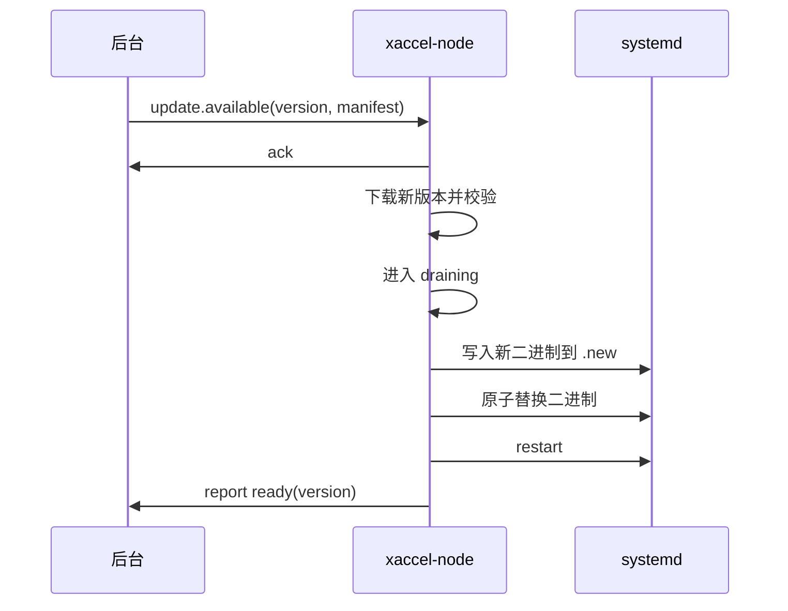

# 节点运维、升级与回滚

本文描述 Linux 节点安装后的运维闭环，包括状态、日志、升级、回滚、卸载和安全策略。

## 运行状态

节点状态建议统一为：

| 状态 | 说明 |
| --- | --- |
| `installing` | 安装器正在运行 |
| `registered` | 已获取节点身份，但服务未启动 |
| `starting` | 服务启动中 |
| `ready` | 正常接入新连接 |
| `degraded` | 部分能力异常，例如 QUIC 不可用或某个运营商 IP 绑定失败 |
| `draining` | 摘流中，不接受新连接 |
| `offline` | 后台心跳超时 |
| `failed` | 服务启动失败或配置不可用 |

## 日志

日志分三类：

```text
journalctl -u xaccel-node -f
/var/log/xaccel-node/install.log
/var/log/xaccel-node/audit.log
```

`install.log` 记录安装器行为。  
`audit.log` 记录配置变更、升级、回滚、踢用户、进入 drain 等管理动作。  
运行日志使用 systemd journal，后续可加本地滚动文件。

## 健康检查

本地健康接口只监听 `127.0.0.1`：

```http
GET http://127.0.0.1:9876/health
```

响应：

```json
{
  "status": "ready",
  "node_id": 1001,
  "version": "0.1.0",
  "config_revision": 20001,
  "listeners": [
    {"addr": "1.2.3.4:666", "transport": "quic_udp", "status": "listening"}
  ],
  "active_sessions": 1200
}
```

安装器安装完成后通过这个接口确认服务可用。

## 升级策略

推荐三种升级方式：

| 方式 | 说明 |
| --- | --- |
| 手动升级 | 后台点击升级，节点收到事件后执行 |
| 灰度升级 | 按地区、标签、节点比例分批升级 |
| 强制升级 | 存在严重漏洞时触发 |

升级流程：



## 回滚策略

每次升级保留上一个可用版本：

```text
/usr/local/bin/xaccel-node
/usr/local/bin/xaccel-node.prev
/var/lib/xaccel-node/releases/0.1.0/
/var/lib/xaccel-node/releases/0.1.1/
```

如果新版本 30 秒内没有变成 `ready`：

- 自动恢复 `xaccel-node.prev`。
- 重启服务。
- 上报 `upgrade_rollback`。

配置回滚独立于二进制回滚：

- 新配置校验失败：拒绝加载。
- 新配置加载后监听失败：进入 `degraded` 或回滚到上一版配置。
- 关键入口全部失败：回滚配置。

## 卸载

卸载命令：

```bash
/usr/local/bin/xaccel-node-uninstall
```

行为：

- 停止并禁用 systemd 服务。
- 删除 `/usr/local/bin/xaccel-node`。
- 删除 systemd unit。
- 默认保留 `/var/lib/xaccel-node/identity.json` 和日志。
- 加 `--purge` 才删除身份和日志。

## 防火墙策略

安装器默认只检测，不强行改防火墙。可选参数：

```bash
--open-firewall
```

支持：

- `ufw`
- `firewalld`
- `nftables` 简单规则

如果没有该参数，只输出需要开放的端口：

```text
Please allow UDP/TCP 666 from client networks.
```

## 安全策略

- bootstrap token 一次性、短有效期。
- node_secret 每节点独立。
- 节点请求使用 HMAC：`node_id + timestamp + nonce + body_sha256`。
- 后台响应配置使用签名。
- 安装器校验二进制 SHA256 和签名。
- 管理接口只监听本地或后台内网。
- 节点不执行后台下发的任意命令。

## 常用运维命令

```bash
systemctl status xaccel-node
journalctl -u xaccel-node -f
systemctl restart xaccel-node
/usr/local/bin/xaccel-node --check-config /etc/xaccel-node/config.toml
/usr/local/bin/xaccel-node --version
curl http://127.0.0.1:9876/health
```

