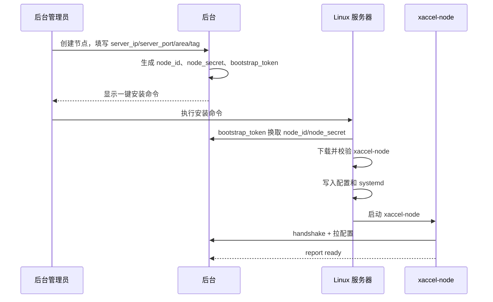

# 一键安装与交付设计

目标是让后台生成一条安装命令，运维在 Linux 服务器上执行后，节点自动完成环境检查、安装二进制、注册后台、拉取配置、启动服务和健康上报。

## 安装目标形态

后台节点详情页生成命令：

```bash
curl -fsSL https://install.example.com/xaccel-node.sh | bash -s -- \
  --bootstrap-url https://api.example.com/api/node/v1/bootstrap \
  --bootstrap-token one-time-token
```

不建议把永久 `node_secret` 放进命令。推荐后台生成一次性 `bootstrap_token`，有效期 5-30 分钟，只能兑换一次。

## 安装模式

| 模式 | 适用场景 | 命令参数 |
| --- | --- | --- |
| bootstrap | 后台已创建节点，服务器首次安装 | `--bootstrap-url`、`--bootstrap-token` |
| explicit | 私有环境或离线部署 | `--node-id`、`--node-secret`、`--panel-url` |
| local-package | 无公网环境 | `--package /path/xaccel-node.tar.gz` |
| reinstall | 重装节点但保留身份 | `--keep-identity` |

第一阶段只实现 `bootstrap`，其他模式保留接口。

## 后台生成安装命令流程



## 安装器职责

安装器负责：

- 检查 root 权限、Linux 发行版、CPU 架构、内核版本。
- 检查端口是否被占用。
- 检查服务器 IP 是否绑定在本机网卡上。
- 创建 `xaccel` 系统用户和目录。
- 下载 release manifest、二进制和签名。
- 校验 SHA256 和签名。
- 写入 `/etc/xaccel-node/config.toml`。
- 写入 `/etc/systemd/system/xaccel-node.service`。
- 应用保守 sysctl 调优。
- 启动服务并等待健康。
- 输出安装结果、日志路径、卸载命令。

安装器不负责：

- 不自动清空防火墙规则。
- 不执行后台下发的任意 shell 命令。
- 不修改 SSH 配置。
- 不删除已有业务进程。

## 预检项

| 检查 | 失败处理 |
| --- | --- |
| 必须 root | 退出 |
| 架构 `x86_64`/`aarch64` | 不支持则退出 |
| Linux kernel >= 5.10 | 警告或退出，生产建议退出 |
| systemd 可用 | 无 systemd 则退出 |
| curl 或 wget 可用 | 尝试安装或提示 |
| `server_port` 未被占用 | 占用则退出 |
| `server_ip` 在本机 | 非本机 IP 则退出 |
| 磁盘空间 > 200MB | 不足则退出 |
| 时间同步正常 | 偏差过大则警告 |

## 目录布局

```text
/usr/local/bin/xaccel-node
/etc/xaccel-node/config.toml
/etc/systemd/system/xaccel-node.service
/var/lib/xaccel-node/identity.json
/var/lib/xaccel-node/cache/
/var/log/xaccel-node/
/run/xaccel-node/
```

## 身份文件

`/var/lib/xaccel-node/identity.json`：

```json
{
  "node_id": 1001,
  "node_secret": "base64-secret",
  "panel_url": "https://api.example.com",
  "created_at": 1779250000
}
```

权限：

```text
owner: root:xaccel
mode: 0640
```

## Release Manifest

安装器先下载 manifest：

```json
{
  "version": "0.1.0",
  "channel": "stable",
  "published_at": 1779250000,
  "artifacts": [
    {
      "os": "linux",
      "arch": "x86_64",
      "url": "https://download.example.com/xaccel-node/0.1.0/xaccel-node-linux-x86_64.tar.gz",
      "sha256": "hex",
      "signature": "base64"
    }
  ]
}
```

后续可用 cosign、minisign 或自研 Ed25519 公钥校验签名。第一阶段至少要校验 SHA256。

## Bootstrap API

```http
POST /api/node/v1/bootstrap
```

请求：

```json
{
  "bootstrap_token": "one-time-token",
  "hostname": "node-hk-01",
  "os": "linux",
  "arch": "x86_64",
  "kernel": "6.1.0",
  "ips": ["1.2.3.4"],
  "installer_version": "0.1.0"
}
```

响应：

```json
{
  "node_id": 1001,
  "node_secret": "base64-secret",
  "panel_url": "https://api.example.com",
  "server_ip": "1.2.3.4",
  "server_port": 666,
  "config_revision": 20001,
  "network": {
    "server_ip": "1.2.3.4",
    "listen_ip": "0.0.0.0",
    "server_port": 666,
    "relay_server_ip": null,
    "relay_server_port": null,
    "is_support_ipv6": false,
    "disable_quic": false,
    "area": "HK",
    "bandwidth_quality": "normal",
    "tag": "free",
    "operator_ips": {
      "telecom_ip": null,
      "mobile_ip": null,
      "unicom_ip": null
    }
  },
  "release": {
    "version": "0.1.0",
    "manifest_url": "https://install.example.com/releases/stable.json"
  }
}
```

Bootstrap token 使用后立即失效。

## 安装完成输出

```text
XAccel node installed.

Node ID: 1001
Service: systemctl status xaccel-node
Logs: journalctl -u xaccel-node -f
Config: /etc/xaccel-node/config.toml
Uninstall: /usr/local/bin/xaccel-node-uninstall
```

## 一键安装脚本的边界

一键安装可以降低交付成本，但不要把所有逻辑塞进 shell。shell 只做 bootstrap、下载、校验、安装和启动。复杂逻辑放进 `xaccel-node` 本体，例如配置校验、网络监听检查、健康上报和升级策略。
